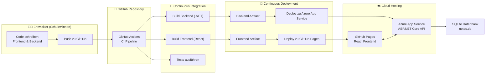

# ClassNotes – Fullstack CI/CD Projekt

Dieses Projekt zeigt ein vollständiges DevOps-Beispiel mit:

- React-Frontend (GitHub Pages Deployment)
- ASP.NET Core Minimal API Backend (Azure App Service Deployment)
- SQLite Datenbank
- GitHub Actions CI/CD Pipelines

## Ordnerstruktur
- /frontend → React App
- /ClassNotes.Api → ASP.NET Core Minimal API
- /.github/workflows → CI/CD Pipelines

## Technologien
- React + Vite
- ASP.NET Core 10
- Entity Framework Core + SQLite
- GitHub Actions
- Azure App Service
- GitHub Pages
-------------------------------------

