# ClassNotes – Fullstack CI/CD Projekt

Dieses Projekt zeigt ein vollständiges DevOps-Beispiel mit:

- React-Frontend (GitHub Pages Deployment)
- ASP.NET Core Minimal API Backend (Azure App Service Deployment)
- SQLite Datenbank
- GitHub Actions CI/CD Pipelines

## Ordnerstruktur
- /frontend → React App
- /ClassNotes.Api → ASP.NET Core Minimal API
- /.github/workflows → CI/CD Pipelines

## Technologien
- React + Vite
- ASP.NET Core 10
- Entity Framework Core + SQLite
- GitHub Actions
- Azure App Service
- GitHub Pages
-------------------------------------

```mermaid
flowchart LR
  %% === Entwickler ===
  subgraph DEV["👨‍💻 Entwickler (Schüler*innen)"]
    A["Code schreiben<br>Frontend & Backend"]
    B["Push zu GitHub"]
  end

  A --> B

  %% === GitHub Repository ===
  subgraph REPO["🐙 GitHub Repository"]
    B --> C["GitHub Actions<br>CI Pipeline"]
  end

  %% === Continuous Integration ===
  subgraph CI["🔧 Continuous Integration"]
    C --> D1["Build Backend (.NET)"]
    C --> D2["Build Frontend (React)"]
    C --> D3["Tests ausführen"]
  end

  D1 --> E1["Backend Artifact"]
  D2 --> E2["Frontend Artifact"]

  %% === Continuous Deployment ===
  subgraph CD["🚀 Continuous Deployment"]
    E1 --> F1["Deploy zu Azure App Service"]
    E2 --> F2["Deploy zu GitHub Pages"]
  end

  %% === Cloud Hosting ===
  subgraph CLOUD["☁️ Cloud Hosting"]
    F1 --> G1["Azure App Service<br>ASP.NET Core API"]
    F2 --> G2["GitHub Pages<br>React Frontend"]
  end

  G1 --> H["SQLite Datenbank<br>notes.db"]
  G2 <--> G1
```

